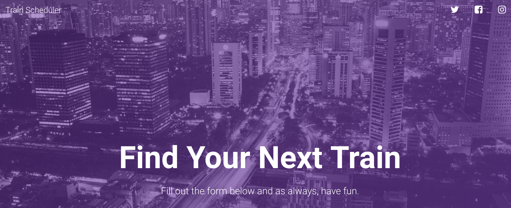

# Train Scheduler :steam_locomotive:
UT Austin Coding Bootcamp | Unit 7 Firebase \
[https://playeasynow.github.io/Train-Schedule/](https://playeasynow.github.io/Train-Schedule/) \
v1.0 \
Orig. Deployment - September 29, 2018

# Idea
My first attempt at using firebase! Since I became comfortable working on firebase, I took the opportunity to focus on the UI a bit more! I used Google's Material Design for the aesthetic.

# User Guide

Here's how it works:

- Scroll down and submit the following:
-- Train Name
-- Destination
-- First Train Time -- in military time
-- Frequency -- in minutes
- Then, the app will calculate when the next train will arrive; this will be relative to the current time.
- Users from many different machines will be able to view same train times.
- Have fun!

The game uses a basic Firebase database, so good for a great first run at playing with a remote database!

# Built Utilizing: 
SVG images and animations \
Google's Material Design \
Firebase \
Bootstrap v4 - <https://stackpath.bootstrapcdn.com/bootstrap/4.1.3/css/bootstrap.min.css> \
jQuery 3.x - <http://code.jquery.com/jquery-3.3.1.min.js> 

# Original Contributors:
Ezequiel Calderon (current edition and ongoing maintenance) - <https://github.com/playeasynow>

# Get Involved!
If you have any recommendations, let me know! Email: ezequiel.calderon.jr@gmail.com. If you'd like to take it in your own direction, go right ahead. 
